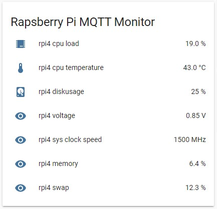

# Rapsberry Pi MQTT monitor
Python script to check the cpu load, cpu temperature, free space, used memory, swap usage, voltage and system clock speed
on a Raspberry Pi computer and publish the data to a MQTT broker.

I wrote this so I can monitor my raspberries at home with [home assistant](https://www.home-assistant.io/). The script was written and tested on Python 2 but it should work fine on Python 3.
The script if very light, it takes 3 seconds as there are 5 half second sleeps in the code - due to mqtt haveing problems if I shoot the messages with no delay, this is only if you choose to send the messages separetely, now the script support a group CSV message that don't have this delay.

Each value measured by the script is send via a separate message for easier craetion of home assistant sensors.

Example message topic if ```group_messages = False ```:
```
masoko/rpi4/cpuload
```
- first part (masoko) is the main topic configurable via the ```config.py``` file.
- second part (pi4) is the host name of the raspberry which is automatically pulled by the script, so you don't have to configure it for each installation (in case you have many raspberries like me).
- third part (cpuload) is the name of the value (these are all values published via MQTT - cpuload, cputemp, diskusage, voltage, sys_clock_speed).

Example message topic if ```group_messages = True ```:

```
masoko/rpi4
```
The csv message looks like this:

```csv
9.0, 43.0, 25, 25, 0.85, 1500, False, False
```

Disabled sensors are represented with False in the message.

# Installation

If you don't have pip installed:
```bash
$ sudo apt install python-pip
```
Then install this module needed for the script:
```bash
$ pip install paho-mqtt
```

Copy ```/src/rpi-cpu2mqtt.py``` and ```/src/config.py.example``` to a folder of your choise (I am using ```/home/pi/scripts/``` ) and rename ```config.py.example``` to ```config.py``` 

# Configuration

Populate the variables for MQTT host, user, password and main topic in ```config.py```.

You can also choose what messages are send and what is the delay between them.

This is the default configuration:

```
group_messages = True 
sleep_time = 0.5
cpu_load = True
cpu_temp = True
used_space = True
voltage = True
sys_clock_speed = True
swap = False
memory = False
```

If the ```group_messages``` is set to true the script will send just one message containing all values in CSV format.
The group message looks like this:
```
{'used_space': '25', 'sys_clock_speed': '1500', 'cpu_temp': '43.0', 'voltage': '0.8500', 'cpu_load': '1.25', 'memory': 'False', 'swap': 'False'}
```

Test the script.
```bash
$ /usr/bin/python /home/pi/scripts/rpi-cpu2mqtt.py
```
Once you test the script there will be no output if it run OK but you should get 5 messages via the configured MQTT server (the messages count depends on your configuration).

Create a cron entry like this (you might need to update the path in the cron entry below, depending on where you put the script files):
```
*/2 * * * * /usr/bin/python /home/pi/scripts/rpi-cpu2mqtt.py
```
# Home Assistant Integration



Once you installed the script on your raspberry you need to create some sensors in home assistant.


This is the sensors configuration if ```group_messages = True``` assuming your sensors are separated in ```sensors.yaml``` file.
```yaml
  - platform: mqtt
    name: 'rpi4 cpu load'
    state_topic: 'masoko/rpi4'
    value_template: '{{ value.split(",")[0] }}'
    unit_of_measurement: "%"

  - platform: mqtt
    state_topic: 'masoko/rpi4'
    value_template: '{{ value.split(",")[1] }}'
    name: rpi4 cpu temp
    unit_of_measurement: "°C"

  - platform: mqtt
    state_topic: 'masoko/rpi4'
    value_template: '{{ value.split(",")[2] }}'
    name: rpi4 diskusage
    unit_of_measurement: "%"

  - platform: mqtt
    state_topic: 'masoko/rpi4'
    value_template: '{{ value.split(",")[3] }}'
    name: rpi4 voltage
    unit_of_measurement: "V"

  - platform: mqtt
    state_topic: 'masoko/rpi4'
    value_template: '{{ value.split(",")[4] }}'
    name: rpi4 sys clock speed
    unit_of_measurement: "MHz"

  - platform: mqtt
    state_topic: 'masoko/rpi4'
    value_template: '{{ value.split(",")[5] }}'
    name: rpi4 swap
    unit_of_measurement: "%" 

  - platform: mqtt
    state_topic: 'masoko/rpi4'
    value_template: '{{ value.split(",")[6] }}'
    name: rpi4 memory
    unit_of_measurement: "%" 
```

This is the sensors configuration if ```group_messages = False``` assuming your sensors are separated in ```sensors.yaml``` file.
```yaml
  - platform: mqtt
    state_topic: "masoko/rpi4/cpuload"
    name: rpi4 cpu load
    unit_of_measurement: "%"

  - platform: mqtt
    state_topic: "masoko/rpi4/cputemp"
    name: rpi4 cpu temp
    unit_of_measurement: "°C"

  - platform: mqtt
    state_topic: "masoko/rpi4/diskusage"
    name: rpi4 diskusage
    unit_of_measurement: "%"

  - platform: mqtt
    state_topic: "masoko/rpi4/voltage"
    name: rpi4 voltage
    unit_of_measurement: "V"

  - platform: mqtt
    state_topic: "masoko/rpi4/sys_clock_speed"
    name: rpi4 sys clock speed
    unit_of_measurement: "hz"

  - platform: mqtt
    state_topic: "masoko/rpi4/swap"
    name: rpi4 swap
    unit_of_measurement: "%" 

  - platform: mqtt
    state_topic: "masoko/rpi4/memory"
    name: rpi4 memory
    unit_of_measurement: "%"
```

Add this to your ```customize.yaml``` file to change the icons of the sensors.

```yaml
sensor.rpi4_voltage:
  friendly_name: rpi 4 voltage
  icon: mdi:flash
sensor.rpi4_cpu_load:
  friendly_name: rpi4 cpu load
  icon: mdi:chip
sensor.rpi4_diskusage:
  friendly_name: rpi4 diskusage
  icon: mdi:harddisk
sensor.rpi4_sys_clock_speed:
  icon: mdi:clock
sensor.rpi4_cpu_temp:
  friendly_name: rpi4 cpu temperature
sensor.rpi4_swap:
  icon: mdi:folder-swap
sensor.rpi4_memory:
  icon: mdi:memory
```

After that you need to create entities list via the home assistant GUI.
You can use this code or compose it via the GUI.

```yaml
type: entities
title: Rapsberry Pi MQTT monitor
entities:
  - entity: sensor.rpi4_cpu_load
  - entity: sensor.rpi4_cpu_temp
  - entity: sensor.rpi4_diskusage
  - entity: sensor.rpi4_voltage
  - entity: sensor.rpi4_sys_clock_speed
  - entity: sensor.rpi4_swap
  - entity: sensor.rpi4_memory
```
# To Do
- add uptime monitoring
- maybe add network trafic monitoring via some third party software (for now I can't find a way to do it without additinal software)